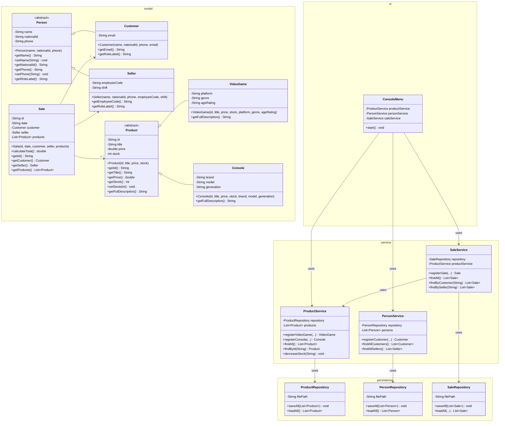

# Class diagram — full system by layer

```mermaid
classDiagram
    namespace model {
        class Person {
            <<abstract>>
            -String name
            -String nationalId
            -String phone
            +Person(name, nationalId, phone)
            +getName() String
            +setName(String) void
            +getNationalId() String
            +getPhone() String
            +setPhone(String) void
            +getRoleLabel()* String
        }
        class Customer {
            -String email
            +Customer(name, nationalId, phone, email)
            +getEmail() String
            +getRoleLabel() String
        }
        class Seller {
            -String employeeCode
            -String shift
            +Seller(name, nationalId, phone, employeeCode, shift)
            +getEmployeeCode() String
            +getRoleLabel() String
        }
        class Product {
            <<abstract>>
            -String id
            -String title
            -double price
            -int stock
            +Product(id, title, price, stock)
            +getId() String
            +getTitle() String
            +getPrice() double
            +getStock() int
            +setStock(int) void
            +getFullDescription()* String
        }
        class VideoGame {
            -String platform
            -String genre
            -String ageRating
            +VideoGame(id, title, price, stock, platform, genre, ageRating)
            +getFullDescription() String
        }
        class Console {
            -String brand
            -String model
            -String generation
            +Console(id, title, price, stock, brand, model, generation)
            +getFullDescription() String
        }
        class Sale {
            -String id
            -String date
            -Customer customer
            -Seller seller
            -List~Product~ products
            +Sale(id, date, customer, seller, products)
            +calculateTotal() double
            +getId() String
            +getCustomer() Customer
            +getSeller() Seller
            +getProducts() List~Product~
        }
    }
    namespace persistence {
        class ProductRepository {
            -String filePath
            +saveAll(List~Product~) void
            +loadAll() List~Product~
        }
        class PersonRepository {
            -String filePath
            +saveAll(List~Person~) void
            +loadAll() List~Person~
        }
        class SaleRepository {
            -String filePath
            +saveAll(List~Sale~) void
            +loadAll(...) List~Sale~
        }
    }
    namespace service {
        class ProductService {
            -ProductRepository repository
            -List~Product~ products
            +registerVideoGame(...) VideoGame
            +registerConsole(...) Console
            +findAll() List~Product~
            +findById(String) Product
            +decreaseStock(String) void
        }
        class PersonService {
            -PersonRepository repository
            -List~Person~ persons
            +registerCustomer(...) Customer
            +findAllCustomers() List~Customer~
            +findAllSellers() List~Seller~
        }
        class SaleService {
            -SaleRepository repository
            -ProductService productService
            +registerSale(...) Sale
            +findAll() List~Sale~
            +findByCustomer(String) List~Sale~
            +findBySeller(String) List~Sale~
        }
    }
    namespace ui {
        class ConsoleMenu {
            -ProductService productService
            -PersonService personService
            -SaleService saleService
            +start() void
        }
    }

    Person <|-- Customer
    Person <|-- Seller
    Product <|-- VideoGame
    Product <|-- Console
    Sale --> "1" Customer
    Sale --> "1" Seller
    Sale --> "1..*" Product
    ProductService --> ProductRepository : uses
    PersonService --> PersonRepository : uses
    SaleService --> SaleRepository : uses
    SaleService --> ProductService : uses
    ConsoleMenu --> ProductService : uses
    ConsoleMenu --> PersonService : uses
    ConsoleMenu --> SaleService : uses
```
