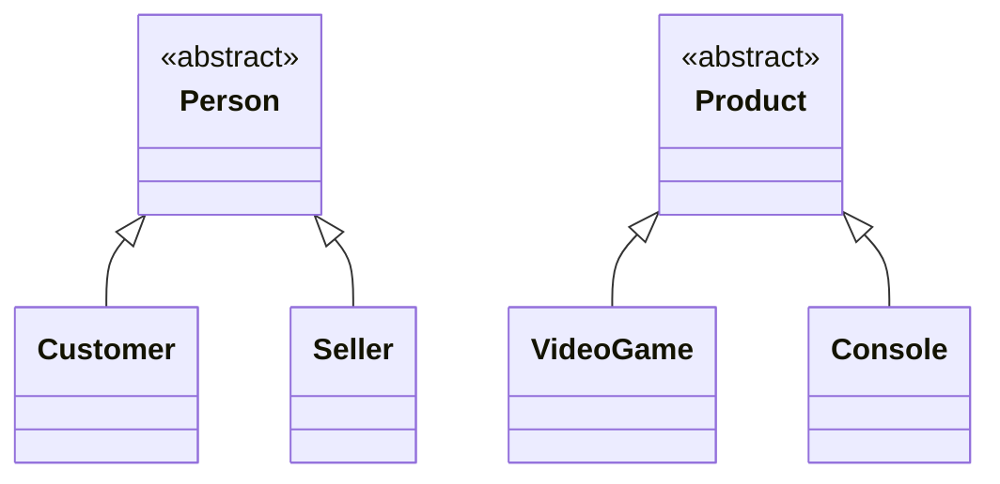

# Hierarchy diagram — model layer only

Only inheritance, no associations. Abstract vs concrete marked.

```mermaid
classDiagram
    class Person {
        <<abstract>>
    }
    class Customer {

    }
    class Seller {

    }
    Person <|-- Customer
    Person <|-- Seller

    class Product {
        <<abstract>>
    }
    class VideoGame {

    }
    class Console {

    }
    Product <|-- VideoGame
    Product <|-- Console
```
