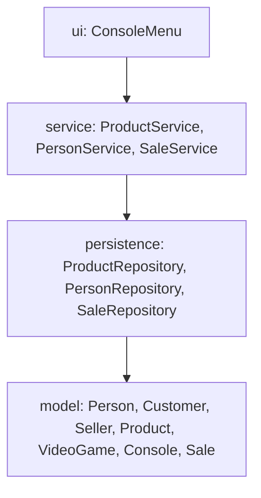

# Layers diagram (Mermaid) — TODO

```mermaid
flowchart TB
    UI["ui: ConsoleMenu"] --> SVC["service: ProductService, PersonService, SaleService"]
    SVC --> PERS["persistence: ProductRepository, PersonRepository, SaleRepository"]
    PERS --> MOD["model: Person, Customer, Seller, Product, VideoGame, Console, Sale"]
```
Allowed: ui->service, service->model+persistence, persistence->model. Forbidden: model->any, ui->persistence direct, file I/O in model.
