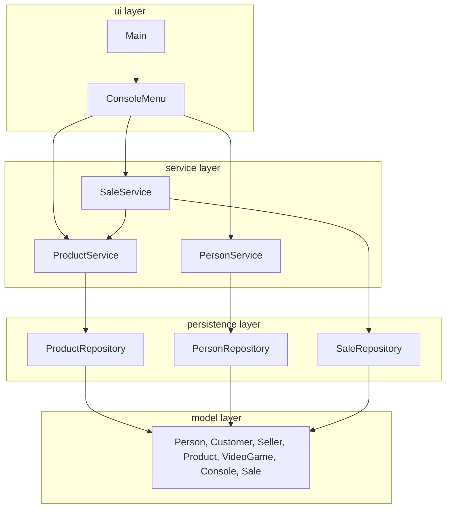

# Layers diagram

```mermaid
flowchart TB
    subgraph UI["ui layer"]
        CM[ConsoleMenu]
        MN[Main]
    end
    subgraph SVC["service layer"]
        PS[ProductService]
        PES[PersonService]
        SS[SaleService]
    end
    subgraph PER["persistence layer"]
        PR[ProductRepository]
        PER2[PersonRepository]
        SR[SaleRepository]
    end
    subgraph MOD["model layer"]
        MO[Person, Customer, Seller, Product, VideoGame, Console, Sale]
    end
    CM --> PS
    CM --> PES
    CM --> SS
    MN --> CM
    PS --> PR
    PES --> PER2
    SS --> SR
    SS --> PS
    PR --> MO
    PER2 --> MO
    SR --> MO
```
Allowed only: ui->service, service->persistence+model, persistence->model. Model depends on none. UI never touches persistence directly.
